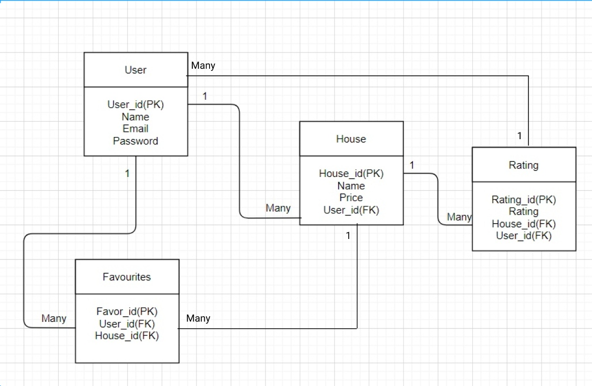

# Find House

## Description

- users can view all houses,
- authorized user can add house
- authorized user can add house to favourite list
- authorized user can remove house from favourite list
- authorized user can view their favourite list

  The app also uses a Rails API [found here](https://github.com/ansaryergesh/find_house_backend) that stores the data of the users, houses, and favourites.

## ER Diagram

At the moment, the project includes only user, house and favourite tables.


### Install, Run and Build program

```
npm install

npm start

npm run build

```

## Live Demo

[Live Demo](https://reactcapstone.ansaryergesh.com)

## Built With

- React
- Redux
- JavaScript
- Semantic UI
- Rails

## Screenshot


## Future Features

- Make function to rate house
- Make function to add comment for house
- Improve UI of application

## Author:

👤 **Ansar Yergeshov**

- Github: [@ansaryergesh](https://github.com/ansaryergesh)
- Twitter: [@ansaryergesh](https://twitter.com/ansaryergesh)
- Linkedin: [Ansar Yergeshov](https://www.linkedin.com/in/ansaryergesh/)
- Gmail: yergeshovansar@gmail.com

## 🤝 Contributing

Contributions, issues and feature requests are welcome!

Feel free to check the [issues page](issues/).

## Show your support

Give a ⭐️ if you like this project!

## 📝 License

This project is [MIT](lic.url) licensed.
